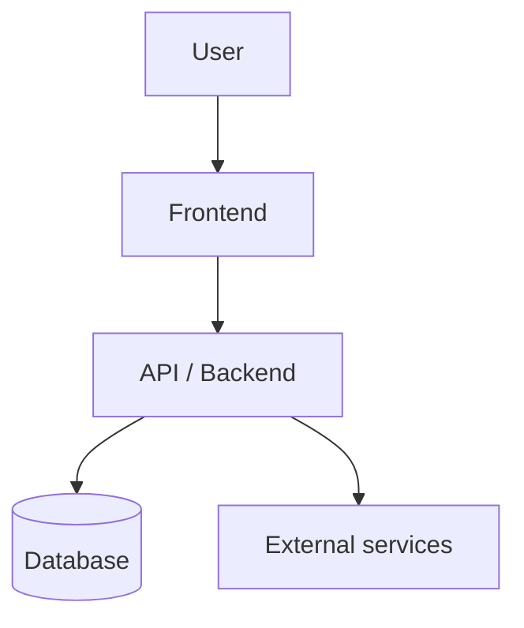
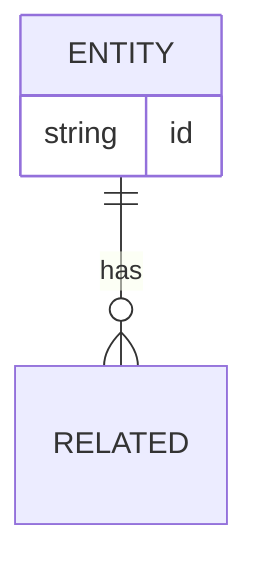

# <Project> — Architecture

> Living document. Keep the diagram current as the product evolves.
> Standard: `~/.claude/sop/ARCHITECTURE.md`
> **Status:** Authored | Reconstructed | Draft — *(Reconstructed = inferred from existing code, not author-verified)*
> **Last updated:** YYYY-MM-DD

## Overview
<one-paragraph description of the system>

## System diagram

## Data model

## Modules & boundaries
> What each unit does, how they communicate, who depends on whom.

- `<module>` — responsibility — depends on —

## Cloud reference architecture
> Based on the PRD's preferred cloud (AWS / GCP / Azure). Research the provider's reference/
> Well-Architected guidance and propose resources before provisioning.

- Provider:
- Compute:
- Storage / database:
- Networking / auth:
- Elasticity & scalability plan (sized to the PRD's load):

## Failure handling
> Errors, retries, partial failures, fallbacks.

-

---
> Key architectural decisions are logged in `docs/decisions.md` (ADR-lite).

# Detailed Architecture Diagram (.drawio) — instructions for agents

Within the doc folder holds the project's architecture diagram as a draw.io file:
**`ArchitectureDiagram.drawio`** — currently a blank template with a single placeholder shape, waiting for the first real design.

## When to update it

Whenever you (the agent) are planning or designing a solution of any real size — a new feature, a multi-part system, a non-trivial refactor — **draw the architecture out in this file before writing implementation code.**
Don't just describe the design in chat; put it on the diagram.

## Validate before building

Once you've drawn (or updated) the diagram, **walk the human operator through it and get their confirmation before proceeding to implementation.**
The diagram is the proposal — treat it the same way you'd treat a plan the user needs to approve. If they ask for changes, update the diagram first, then re-confirm, then build.

## Multiple components → multiple pages

A `.drawio` file can hold more than one page (draw.io calls them "sheets" — each is a separate `<diagram>` element inside the same `<mxfile>`, shown as tabs along the bottom of the editor). If the project has several large, distinct components, give each its own page rather than cramming everything onto one canvas — e.g. one page for the overall system, others for individual services/modules that deserve their own detail. Keep names descriptive (rename `Page-1` to something meaningful) rather than leaving them numbered.

## Relationship to the ARCHITECTURE SOP's Mermaid diagram

The user's global `CLAUDE.md` also defines an `ARCHITECTURE` SOP pointing at a Mermaid diagram in `docs/architecture.md` for the same "propose + diagram first" step. **The two coexist — this is not a replacement.** When planning or designing a solution, update *both*: keep `docs/architecture.md`'s Mermaid diagram current as the quick, text-native reference, and draw the same architecture out in this `.drawio` file as the fuller, visual version.
Validate both with the human operator before implementation, per the rules above.