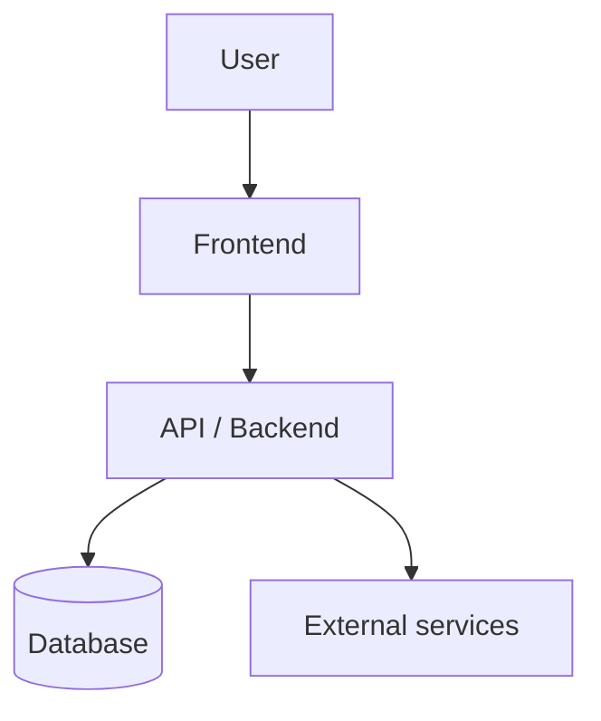
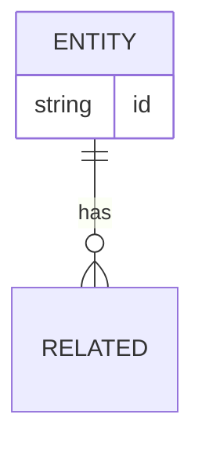

# <Project> — Architecture

> Living document. Keep the diagram current as the product evolves.
> Standard: `~/.claude/sop/ARCHITECTURE.md`

## Overview
<one-paragraph description of the system>

## System diagram

## Data model

## Modules & boundaries
> What each unit does, how they communicate, who depends on whom.

- `<module>` — responsibility — depends on —

## Cloud reference architecture
> Based on the PRD's preferred cloud (AWS / GCP / Azure). Research the provider's reference/
> Well-Architected guidance and propose resources before provisioning.

- Provider:
- Compute:
- Storage / database:
- Networking / auth:
- Elasticity & scalability plan (sized to the PRD's load):

## Failure handling
> Errors, retries, partial failures, fallbacks.

-

---
> Key architectural decisions are logged in `docs/decisions.md` (ADR-lite).
