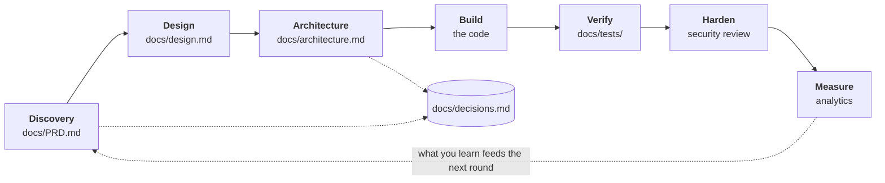

# ClaudeThisIsTheWay

A set of standing instructions that make Claude Code work the same careful way for
everyone on the team — asking before assuming, testing before claiming, and writing
down what it decided.

> Documentation for people installing this. Claude's actual instructions live in
> `.claude/CLAUDE.md`.

## What it does for you

- **Claude asks before it builds.** What problem, for whom, what does success look like.
  No more guessing what you meant.
- **It writes the project down as it goes.** Requirements, decisions, design, an
  architecture diagram, tests in plain English — all in a `docs/` folder you can read.
- **It won't do anything permanent without asking.** No pushing, deploying, or leaking
  secrets into the code. This is the part that makes it safe to hand to someone who
  can't read the diff.

## Before you start

You need Claude Code already installed. Takes about two minutes, and you only do it once.

Everything lives in your **global** Claude folder at `~/.claude/`, so it applies to every
project on your machine automatically.

## Install

Run these four commands in your terminal, in order.

```bash
# 1. Back up whatever Claude setup you have now (skips if you have none yet)
cp -R ~/.claude "$HOME/.claude.backup.$(date +%Y%m%d%H%M%S)" 2>/dev/null \
  || echo "Nothing to back up — first-time setup."

# 2. Download this repo to a temporary folder
git clone https://github.com/WilsonWordsofWisdom/ClaudeThisIsTheWay.git /tmp/claude-tiw

# 3. Add the standards to your Claude setup
mkdir -p ~/.claude && cp -R /tmp/claude-tiw/.claude/. ~/.claude/

# 4. Tidy up
rm -rf /tmp/claude-tiw
```

**What this changes:** it adds new files, and replaces exactly one — your existing
`CLAUDE.md`. Step 1 backed that up first. Your logins, plugins, settings, and any skills
you already had are untouched.

> ⚠️ **Never** run `rm -rf ~/.claude` to "start clean" — that deletes your skills,
> plugins, settings, and sign-in. The commands above are all you need.

## How to undo it

Delete `~/.claude`, then rename your backup folder back to `~/.claude`. You're exactly
where you started.

## What you'll notice

After installing, Claude behaves differently. All of this is intended:

- **It asks questions before writing code.** It's making sure it builds the right thing.
- **It offers a mockup before building screens.** Say yes — changing a picture is faster
  than changing working code.
- **It writes documents into `docs/` as it goes.** What you asked for, what it decided,
  and why.
- **It asks permission before anything permanent.** Nothing gets pushed or deployed
  without you saying so.

If Claude feels slower than it used to, that's the setup working.

## Already have projects on the go?

It works on those too — you don't need to start something new. When Claude opens a
project that's missing its documents, it offers once to reconstruct them from the code
you already have, and marks them **Reconstructed** so nobody mistakes a description of
the existing system for a record of what was originally decided.

## How it works

*The way, stage by stage.*



Claude reads `CLAUDE.md` at the start of every session. That file is a router: when it
reaches a stage, it opens the matching standard from `sop/` and follows it. Nothing else
is loaded until it's needed.

Two things run underneath every stage: the security rules, which never switch off, and a
troubleshooting log, so a problem solved once doesn't get re-debugged next month.

<details>
<summary><b>The eight standards, in detail</b></summary>

<br>

| # | Stage | File | What it governs |
|---|-------|------|-----------------|
| 1 | Discovery | `PRODUCT_BRIEF.md` | Problem, users, journeys, success metrics, scope & non-goals, data classification |
| 2 | Design | `DESIGN_GUIDE.md` | Material Design baseline, mockup-first gate, accessibility, all screen states |
| 3 | Architecture | `ARCHITECTURE.md` | Propose and diagram before building; cloud reference architecture; Mermaid diagram |
| 4 | Build | `ENGINEERING.md` | Coding standards, mandatory lint/format, commit & PR quality, troubleshooting log |
| 5 | Verify | `TESTING.md` | Gherkin tests from PRD journeys, all test levels, E2E, regression before merge |
| 6 | Harden | `SECURITY_ASSESSMENT.md` | OWASP / MITRE / NIST baseline, scan cadence, data compliance, IM8 for government work |
| 7 | Measure | `ANALYTICS.md` | HEART + north star metrics, SLO dashboard, journey drop-off |
| 8 | **Always on** | `AGENT_SECURITY.md` | No secrets in prompts or git, untrusted content is data, human gate before anything irreversible |

</details>

<details>
<summary><b>What gets created inside your project</b></summary>

<br>

```
your-project/
├─ CLAUDE.md              ← optional: project-specific overrides (stack, ports, conventions)
└─ docs/
   ├─ PRD.md              ← what you're building and why
   ├─ decisions.md        ← dated log of decisions, and the reasoning behind them
   ├─ design.md           ← current layouts and visual language
   ├─ architecture.md     ← current diagram of the system
   ├─ troubleshooting.md  ← problems that recur, and what actually fixed them
   └─ tests/
      └─ *.feature        ← test scenarios in plain English, one per journey
```

To start a project with blank versions of these:

```bash
cp -R ~/.claude/docs <your-project>/docs
```

`PRD.md`, `design.md`, and `architecture.md` each carry a **Status** — *Authored* (written
with you at the time), *Reconstructed* (inferred from existing code), or *Draft*.

**Traceability:** the journeys in the PRD become the tests; the PRD's north star becomes
what the analytics measure.

</details>

<details>
<summary><b>Government work (IM8)</b></summary>

<br>

The IM8 compliance audit ships with this setup and installs automatically — but it stays
dormant unless a project's `docs/PRD.md` declares a government data classification.
Personal projects never see it.

When it does apply, Claude audits the repository against Singapore's IM8 controls and
reports what's covered, what the gaps are, and which controls a repository simply cannot
speak to.

It finds repo-visible gaps. **It is not certification** — it doesn't replace the SSP
process or IDSC/CISO sign-off.

</details>
